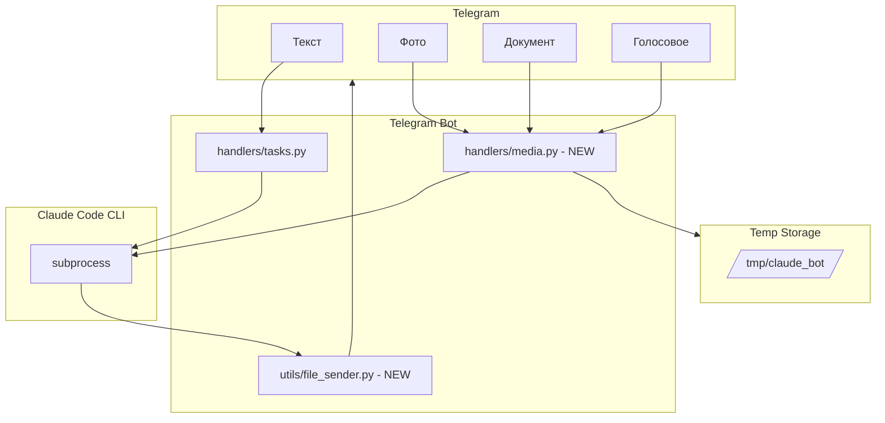

# План: Обмен файлами в Telegram Claude Bot

**Использование:** Открой новый чат в Cursor, прикрепи этот файл (@PLAN_FILE_EXCHANGE.md) и напиши: «Реализуй этот план по шагам».

---

## Текущее состояние

Проект: `telegram_claude_bot/` (корень: `/Users/aleksandrgrebeshok/Проекты VScode/telegram_claude_bot/`)

Бот уже умеет:
- Принимать текстовые сообщения
- Отправлять их в Claude Code CLI
- Возвращать текстовые ответы
- Выбирать модель (Opus/Sonnet/Haiku)
- Запрашивать подтверждение опасных операций

## Архитектура изменений



## Часть 1: Приём файлов от пользователя

### 1.1 Создать новый handler для медиа

Файл: `bot/handlers/media.py`

- Роутер с хендлерами: `F.photo`, `F.document`, `F.voice`
- TEMP_DIR = `/tmp/claude_bot` (поддиректории: photos/, documents/, voice/)
- Фото: скачать в temp, промпт Claude «Проанализируй изображение: <путь>»
- Документ: скачать, промпт «Вот файл для работы: <путь>»
- Голос: скачать .ogg, speech_to_text(), затем вызвать process_task с текстом
- Использовать общую логику выполнения задач из tasks.py (execute_claude_task), чтобы не дублировать код

### 1.2 Обновить main.py

- `from .handlers import commands, tasks, management, media`
- `dp.include_router(media.router)` — **до** `tasks.router`

### 1.3 Структура temp директории

```
/tmp/claude_bot/
├── photos/
├── documents/
├── voice/
└── output/
```

## Часть 2: Отправка файлов пользователю

### 2.1 Создать утилиту: bot/utils/file_sender.py

- Паттерны для поиска путей в ответе Claude (регулярки для /path/to/file.ext, /tmp/..., «файл: ...», «скриншот: ...» и т.д.)
- `extract_and_send_files(bot, user_id, response)` — найти все пути, проверить os.path.isfile, отправить каждый
- `send_file_by_type(bot, user_id, filepath)` — по расширению: .jpg/.png → send_photo, .mp4 → send_video, .mp3/.ogg → send_audio, остальное → send_document (FSInputFile)
- Дедупликация путей, чтобы один файл не отправлять дважды

### 2.2 Интегрировать в tasks.py

В `send_result(user_id, result)` после отправки текста вызвать `extract_and_send_files(_bot, user_id, result)`.

## Часть 3: Голосовые сообщения

### 3.1 Speech-to-Text (приём голосовых)

Варианты: Whisper (API), Vosk (офлайн), SpeechRecognition + Google. Рекомендация: SpeechRecognition + Google для простоты или Vosk для офлайн.

### 3.2 Text-to-Speech (опционально)

Варианты: edge-tts, gTTS, Silero. Рекомендация: edge-tts.

### 3.3 Реализация

- Файл `bot/utils/speech.py`: функция `speech_to_text(audio_path_or_bytes)` → текст
- В media.py в handle_voice: скачать файл в /tmp/claude_bot/voice/, вызвать speech_to_text, подставить message.text и вызвать process_task (или общий метод запуска задачи с промптом)

## Часть 4: Новые зависимости

В `requirements.txt` добавить:

- edge-tts>=6.1.0
- SpeechRecognition>=3.10
- pydub>=0.25.1

Опционально: openai-whisper, vosk.

## Часть 5: Клавиатура

В `bot/keyboards.py` в main_menu() при необходимости добавить кнопки «Файлы» / «Голос» (информационные или для подсказки).

## Порядок реализации (чек-лист)

1. Создать `bot/utils/` и `bot/utils/__init__.py`
2. Создать `bot/utils/file_sender.py` (отправка файлов пользователю)
3. Создать `bot/handlers/media.py` (приём фото, документов, голосовых)
4. Обновить `bot/main.py` — подключить media router
5. Обновить `bot/handlers/tasks.py` — в send_result вызвать extract_and_send_files
6. Создать `bot/utils/speech.py` (speech_to_text для голосовых)
7. Обновить `requirements.txt`
8. При необходимости обновить `bot/keyboards.py`
9. Перезапустить сервис: `launchctl unload/load ~/Library/LaunchAgents/com.claude-telegram-bot.plist`

## Тестирование

- Отправить фото — бот анализирует
- Отправить PDF — бот читает
- Запрос «сделай скриншот» — бот присылает картинку
- Запрос «создай PDF/файл» — бот присылает файл
- Голосовое сообщение — расшифровка и ответ
